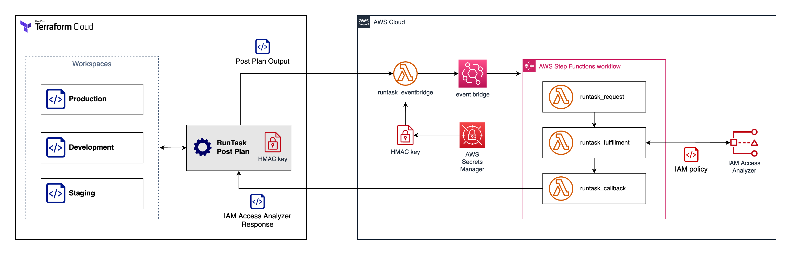

# Terraform Cloud Run Tasks with IAM Access Analyzer

Sample demonstration of Run Tasks integration with IAM Access Analyzer (IA2) to validate IAM policy. This demonstration uses Run Task Post Plan with endpoint served by Lambda Function URL. The IAM policy validation is done using Step Function integrated with IAM Access Analyzer.



# Getting started

## Prerequisites 
This demonstration requires the following prerequisites:
1. AWS account and credentials 
2. Terraform Cloud with Run Task entitlement (Business subscription or higher)

## Setup EventBridge and Lambda function for Run Task

First you need to deploy the Lambda Function URL, Event Bridge rule and Step Function that served as the Run Task request fulfillment. Run the following Terraform module will deploy the required AWS resources and Terraform Cloud Run Task configuration. 

* Clone the repository and change the directory

  ```bash
  git clone git@github.com:wellsiau-aws/runtask-iam-access-analyzer.git
  cd runtask-iam-access-analyzer
  ```

* Build and package the Lambda files

  ```
  cd run-tasks
  make all
  ```

* Change the TFC org name in the file [`run-tasks/provider.tf`](/run-tasks/provider.tf#L5) to your TFC org.

  ```
  terraform {

    cloud {
      # TODO: Change this to your Terraform Cloud org name.
      organization = "<enter your org name here>"
      workspaces {
        tags = ["app:aws-event-bridge"]
      }
    }
    ...
  }   
  ```

* Populate the required variables, change the placeholder value below.
  ```bash
  echo 'tfc_org="<enter your org name here>"' >> tf.auto.tfvars
  echo 'aws_region="<enter the AWS region here>"' >> tf.auto.tfvars
  ```

* Initialize Terraform Cloud. When prompted, enter the name of the new workspace, i.e. `aws-event-bridge-run-task-demo`
  ```bash
  terraform init
  ```

* Configure the AWS credentials (`AWS_ACCESS_KEY_ID` and `AWS_SECRET_ACCESS_KEY`) in Terraform Cloud, i.e. using environment variable.

* In order to create and configure the run tasks, you also need to have Terraform Cloud keys stored as Variable/Variable Sets in the workspace. Add `TFE_HOSTNAME` and `TFE_TOKEN` environment variable to the same variable set or directly on the workspace.


* Run Terraform apply
  ```bash
  terraform apply
  ```

* Navigate to your Terraform Cloud organization, go to Organization Settings > Integrations > Run tasks to find the newly created Run Task `aws-ia2-runtask`. 

You can use this run task in any workspace where you have standard IAM resource policy document. Use the example steps below to continue with the demonstration.

## Attach Run Task in Terraform Cloud Workspace

Follow the steps below to attach the run task created from step earlier into a new **demo workspace**. 

* Use the provided example below to launch simple AWS IAM resources and inspect it with IAM Access Analyzer.

  ```bash
  cd ../examples/
  ```

* Change the org name in the file [`examples/provider.tf`](/examples/provider.tf#L5) to your TFC org.

  ```
  terraform {

    cloud {
      # TODO: Change this to your Terraform Cloud org name.
      organization = "<enter your org name here>"
      workspaces {
        tags = ["env:aws-run-task-demo"]
      }
    }
    ...
  }   
  ```

* Populate the required variables, change the placeholder value below.
  ```bash
  echo 'tfc_org="<enter your org name here>"' >> tf.auto.tfvars
  echo 'aws_region="<enter the AWS region here>"' >> tf.auto.tfvars
  echo 'runtask_id="<enter the Run Task ID output from previous module deployment>"' >> tf.auto.tfvars
  echo 'demo_workspace_name="<enter the new demo workspace name here>"' >> tf.auto.tfvars
  ```

* Initialize Terraform Cloud. When prompted, enter the name of the new demo workspace as you specified in the previous step.
  ```bash
  terraform init
  ```

* Configure the AWS credentials (`AWS_ACCESS_KEY_ID` and `AWS_SECRET_ACCESS_KEY`) in Terraform Cloud, i.e. using variable sets. [Follow these instructions to learn more](https://developer.hashicorp.com/terraform/tutorials/cloud-get-started/cloud-create-variable-set).

 * Enable the flag to attach the run task to the demo workspace.

  ```bash
  echo 'flag_attach_runtask="true"' >> tf.auto.tfvars
  terraform apply
  ```

* Navigate back to Terraform Cloud, locate the new demo workspace and confirm that the Run Task is attached to the demo workspace. 


## Test IAM Access Analyzer using Run Task

The following steps deploy simple IAM policy with invalid permissions. This should trigger the Run Task to send failure and stop the apply.

 * Enable the flag to deploy invalid IAM policy to the demo workspace.

 ```bash
  echo 'flag_deploy_invalid_resource="true"' >> tf.auto.tfvars
  terraform apply
  ```

Terraform apply will fail due to two errors. To fix this error, modify the invalid permisison name:
- `logs:CreateLogGroups` to `logs:CreateLogGroup`  
- `logs:CreateLogStreams` to `logs:CreateLogStream`

To experiment with another types of IAM Access Analyzer policy validation, modify the assume role policy document or the iam role policy in the provided template.

# Limitations

1. Does not provide verbose error / warning messages in Run Task console. In the future, we will explore possibility to provide verbose logging.

2. Does not support Terraform [computed resources](https://www.terraform.io/plugin/sdkv2/schemas/schema-behaviors).
For example, the tool will report no IAM policy found for the following Terraform template. The policy json string is a computed resource. The plan output doesn't contain information of IAM policy document. 

    ```
    resource "aws_s3_bucket" "b" {
      bucket = "my-tf-test-bucket"

      tags = {
        Name        = "My bucket"
        Environment = "Dev"
      }
    }

    resource "aws_iam_policy" "policy" {
      name        = "test-policy"
      description = "A test policy"

      policy = jsonencode({
        Version = "2012-10-17"
        Statement = [
          {
            Action = [
              "s3:GetObject",
            ]
            Effect   = "Allow"
            Resource = "${aws_s3_bucket.b.id}"
          }
        ]
      })
    }
    ```

3. Does not support `inline_policy` and `managed_policy_arns` inside of `aws_iam_role`. This solution only inspect the `assume_role_policy` for `aws_iam_role` resource. To inspect IAM policy attached to `aws_iam_role` resource, we recommend to use `aws_iam_role_policy`.

## Best practice

* **Do not** re-use the Run Tasks URL across different trust-boundary (organizations, accounts, team). We recommend you to deploy separate Run Task deployment per trust-boundary.

* **Do not** use Run Tasks URL from untrusted party, remember that Run Tasks execution sent Terraform plan output to the Run Task endpoint. Only use trusted Run Tasks URL.

* Enable the AWS WAF setup by setting variable `deploy_waf` to `true`, additional cost apply. This will add WAF protection on top of the Run Tasks URL endpoint.

* We recommend you to setup additional CloudWatch alarm to monitor Lambda concurrency and WAF rules.