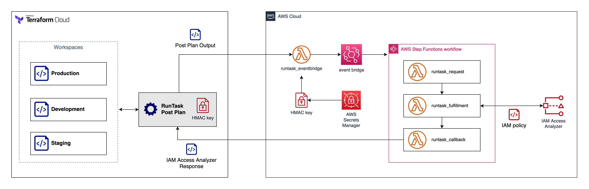

# terraform-runtask-iam-access-analyzer

Use this module to integrate Terraform Cloud Run Tasks with AWS IAM Access Analyzer for policy validation.



## Prerequisites 
To use this module you need have the following:
1. AWS account and credentials 
2. Terraform Cloud with Run Task entitlement (Business subscription or higher)

## Usage 

* Build and package the Lambda files

  ```
  make all
  ```

* Change the TFC org name in the file [`provider.tf`](provider.tf#L5) to your TFC org.

  ```
  terraform {

    cloud {
      # TODO: Change this to your Terraform Cloud org name.
      organization = "<enter your org name here>"
      workspaces {
        tags = ["app:aws-event-bridge"]
      }
    }
    ...
  }   
  ```

* Populate the required variables, change the placeholder value below.
  ```bash
  echo 'tfc_org="<enter your org name here>"' >> tf.auto.tfvars
  echo 'aws_region="<enter the AWS region here>"' >> tf.auto.tfvars
  ```

* Initialize Terraform Cloud. When prompted, enter the name of the new workspace, i.e. `aws-iam_access-analyzer-run-task`
  ```bash
  terraform init
  ```

* Configure the AWS credentials (`AWS_ACCESS_KEY_ID` and `AWS_SECRET_ACCESS_KEY`) in Terraform Cloud, i.e. using environment variable / variable sets.

* In order to create and configure the run tasks, you also need to have Terraform Cloud token stored as Variable/Variable Sets in the workspace. Add `TFE_HOSTNAME` and `TFE_TOKEN` environment variable to the same variable set or directly on the workspace.


* Run Terraform apply
  ```bash
  terraform apply
  ```

* Navigate to your Terraform Cloud organization, go to Organization Settings > Integrations > Run tasks to find the newly created Run Task `aws-ia2-runtask`. 

You can use this run task in any workspace where you have standard IAM resource policy document. Refer to the [examples](./examples) for more details.

## Limitations

1. Does not provide verbose error / warning messages in Run Task console. In the future, we will explore possibility to provide verbose logging.

2. Does not support Terraform [computed resources](https://www.terraform.io/plugin/sdkv2/schemas/schema-behaviors).
For example, the tool will report no IAM policy found for the following Terraform template. The policy json string is a computed resource. The plan output doesn't contain information of IAM policy document. 

    ```
    resource "aws_s3_bucket" "b" {
      bucket = "my-tf-test-bucket"

      tags = {
        Name        = "My bucket"
        Environment = "Dev"
      }
    }

    resource "aws_iam_policy" "policy" {
      name        = "test-policy"
      description = "A test policy"

      policy = jsonencode({
        Version = "2012-10-17"
        Statement = [
          {
            Action = [
              "s3:GetObject",
            ]
            Effect   = "Allow"
            Resource = "${aws_s3_bucket.b.id}"
          }
        ]
      })
    }
    ```

## Best practice

* **Do not** re-use the Run Tasks URL across different trust-boundary (organizations, accounts, team). We recommend you to deploy separate Run Task deployment per trust-boundary.

* **Do not** use Run Tasks URL from untrusted party, remember that Run Tasks execution sent Terraform plan output to the Run Task endpoint. Only use trusted Run Tasks URL.

* Enable the AWS WAF setup by setting variable `deploy_waf` to `true` (additional cost will apply). This will add WAF protection to the Run Tasks URL endpoint.

* We recommend you to setup additional CloudWatch alarm to monitor Lambda concurrency and WAF rules.
